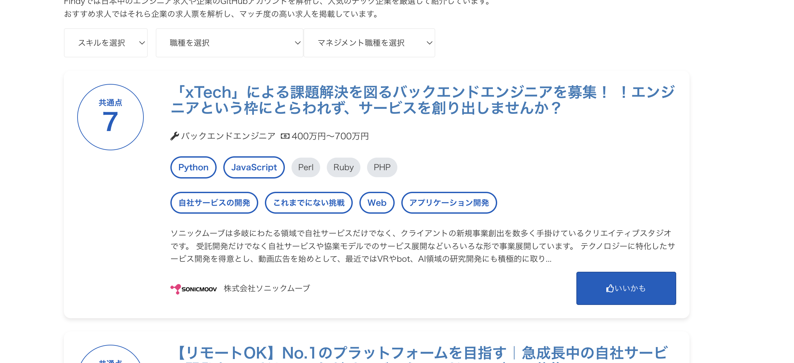

# ミッションステートメントを用いた企業推薦システム

## 卒業研究用リポジトリ

## 開発環境
* dbは9999(仕事のポートとかぶるため)
* network(proxy)は8080
* users(authと特徴分け)は8000
* suggestions(提案部)は8888
で動くようになってる。
デプロイ先は未定。
docker-compose-upでいい感じに動く。

<5月17日〜5月23日>
* 環境構築、(docker-comopseとpycharm)
  
<5月24日〜5月30日>
* 企業特徴量の選定と企業特徴(規模感etc)取得のapi選定
* mvv取得のためのクローラー作成(python or nodejs)
  
<5月31日〜6月6日>
* モデル用の論文探し等
* 提案後UIはこんな感じ。
*  

<6月7日〜6月13日>
* モデルの作成、学習
  
<6月14日〜6月20日>
* 同上
* システムの簡易実装
* 個人情報保護士受験
  
<6月21日〜6月27日>　
* システムの実装
  
<6月28日〜7月4日>
* 予備期間
  
<7月5日〜7月11日>　
中間発表のポスター作成